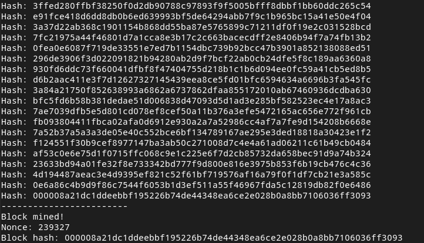
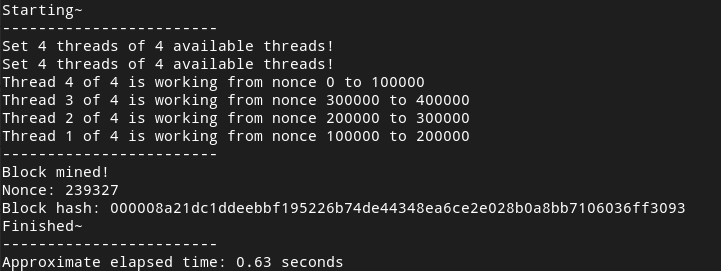
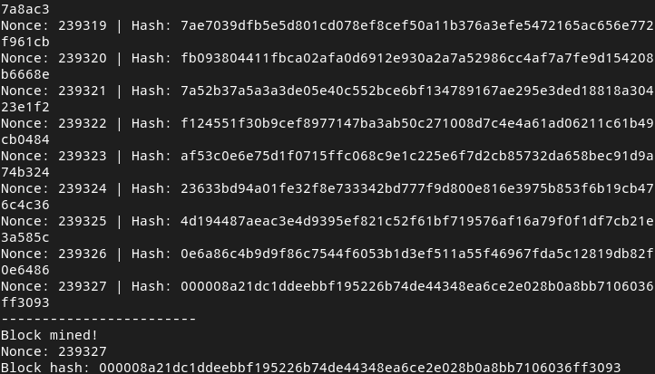
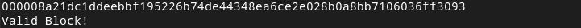

# Proof of Work

This project is a simple proof of work implementation for academic purposes. 
All the credits goes to <a href="https://github.com/marcelohweb/">@marcelohweb</a>.
<br><br>
The original repository from the author:
<br>
https://github.com/marcelohweb/proof-of-work-java
<br>
His article about Blockchain and Proof of Work:
<br>
https://medium.com/@marceloh.web/blockchain-and-proof-of-work-f35ffc33c459

## Running

First, make sure at least Java 8 is installed in your machine and is in the PATH variable:

    java --version
    
Then, clone this repository to a folder and compile the .java files:

    git clone <repository_url>
    cd pow-parallel-java/src/
    javac *.java

## Executing

There are three files: ProofOfWork (the original example), ProofOfWorkParallel (which use threads but just for testing),
and ProofOfWorkRange (which is possible to pass a start-stop range of nonce to attempt).

ProofOfWork have 4 args:
- Difficulty (number of zeros hash should begin with)
- PreviousBlock
- MerkelRoot
- Timestamp

Example of execution of ProofOfWork:

- Command:

```java ProofOfWork 00000 0000038b13568323e3886a7391f6346f555b247bb86f7d9532409874572c45bd 871714dcbae6c8193a2bb9b2a69fe1c0440399f38d94b3a0f1b447275a2991234 1392872245```

- Result:



<hr>

ProofOfWorkParallel have 5 args: 
- Difficulty (number of zeros hash should begin with)
- PreviousBlock
- MerkleRoot
- Timestamp
- Number of processor threads to use

Example of Execution of ProofOfWorkParallel:

- Command:

`java ProofOfWorkParallel 00000 0000038b13568323e3886a7391f6346f555b247bb86f7d9532409874572c45bd 871714dcbae6c8193a2bb9b2a69fe1c0440399f38d94b3a0f1b447275a2991234 1392872245 4`

- Result:



<hr>

ProofOfWorkRange have 6 args:
- Difficulty (number of zeros hash should begin with)
- PreviousBlock
- MerkleRoot
- Timestamp
- Initial nonce (from where it should begin - inclusive)
- Final nonce (until where it should try - exclusive)

Example of Execution of ProofOfWorkRange:

- Command:

`java ProofOfWorkRange 00000 0000038b13568323e3886a7391f6346f555b247bb86f7d9532409874572c45bd 871714dcbae6c8193a2bb9b2a69fe1c0440399f38d94b3a0f1b447275a2991234 1392872245 200000 300000`

- Result:



## Checking

Use the ProofOfWorkVerifier to check if the block mined is valid.

ProofOfWorkVerifier have 5 args:
- Difficulty (number of zeros)
- PreviousBlock
- MerkleRoot 
- Timestamp
- Nonce

Example of Execution of ProofOfWorkVerifier:

- Command:

`java ProofOfWorkVerifier 00000 0000038b13568323e3886a7391f6346f555b247bb86f7d9532409874572c45bd 871714dcbae6c8193a2bb9b2a69fe1c0440399f38d94b3a0f1b447275a2991234 1392872245 239327`

- Result:


